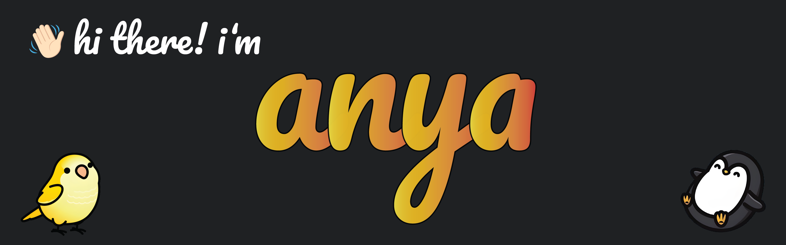

<!-- ### Hi there 👋 -->
---
#### I'm a Computer Science student at Northeastern University concentrating in AI and Psychology. I love all things chess ♟️, aviation ✈️, and board games 🎲.

##### NOW
- ✨ Designing a Portfolio Website
- 😨 Prototyping an Eval Metric for Two-Sentence Horror stories
- 🎮 Creating a gym environment for Super Mario Bros. 3 (to train a neural network)
- 🗺️ Implementing a map app to locate nearby train stations and convenient stops from apartments
- 😎 Working on various accessiblity-focused applications

##### PAST
- 🚧 Created a Tetris AI
- 😱 Figured out a Two-Sentence Horror LM
- 📊 Collaborated on an accessible spreadsheet app

##### BIO
- 😄 Pronouns: `they/them`
- ⚙️ I use daily: `.py (NumPy, Matplotlib, Pandas, TensorFlow)` `.java` `.sql (PostgreSQL)` `.js (Express, React, Node)`
- 🧠 Currently learning: `.py (PyTorch, XGBoost)` `.rust` `all things NLP`
- ⚡️ Fun fact: I'm cross-dominant (left-handed at tennis, right-handed at ping-pong)
- 📫 How to reach me: 
  - 📧 <vo.ant@northeastern.edu>
  - 🤖 [r/AntVo2448](https://www.reddit.com/user/AntVo2448/)

<!--
**AntVo2448/AntVo2448** is a ✨ _special_ ✨ repository because its `README.md` (this file) appears on your GitHub profile.

Here are some ideas to get you started:

- 🔭 I’m currently working on ...
- 🌱 I’m currently learning ...
- 👯 I’m looking to collaborate on ...
- 🤔 I’m looking for help with ...
- 💬 Ask me about ...
- 📫 How to reach me: ...
- 😄 Pronouns: ...
- ⚡ Fun fact: ...
-->
